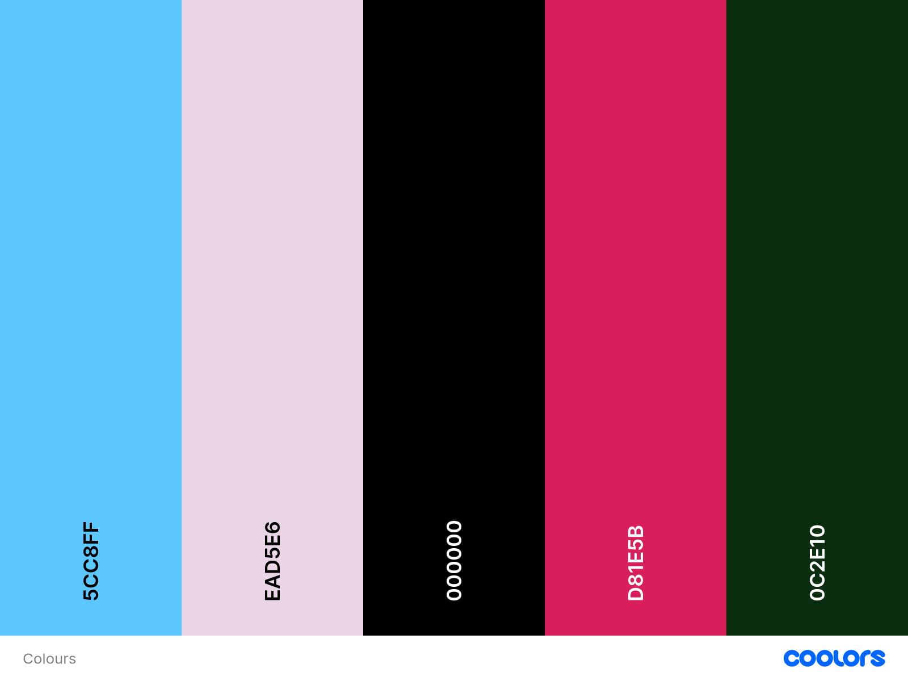

# The Pampered Pet Parlor - A Django-powered platform for pet grooming services that combines booking management, user-friendly features, and responsive design

This is my final project with CodeInstitute, it involves the development of a full-stack web application using the Django Web framework, following Agile methodologies for planning and execution. The application aims to provide an intuitive platform for managing pet grooming services, allowing users to book appointments, manage their profiles, and view posts about past grooms. The website integrates a responsive front-end with custom models to handle user authentication, pet profiles, and booking data, while ensuring accessibility and usability. The project includes database development, CRUD functionality, role-based access control, and notifications, culminating in the deployment of the application to Heroku (a cloud based platform) with a focus on security and performance.

## Table of Contents

1. [User Experience Design](#user-experience-design)
   - [User Personas](#user-personas)
   - [User Stories](#user-stories)
2. [Features](#features)
   - [Core Features](#core-features)
   - [Additional Features](#additional-features)
   - [Future Features](#future-features)
3. [Agile Workflow](#agile-workflow)
4. [Wireframes](#wireframes)
5. [Tech Stack](#tech-stack)
6. [Deployment](#deployment)
7. [FAQ](#faq)
8. [Lessons Learned](#lessons-learned)
9. [Testing](#testing)
10. [Known Issues](#known-issues)
11. [Lighthouse](#lighthouse)
12. [Acknowledgements](#acknowledgements)
13. [Color Reference](#color-reference)
14. [Logo](#logo)
15. [Draw SQL Board](#draw-sql-board)
16. [Credits](#credits)

## User Experience Design
The design of The Pampered Pet Parlor prioritizes user-friendliness and accessibility for all users, whether they are pet owners booking services or groomers managing appointments.

## User Personas
### 1. Pet Owner
- Goal: Easily book grooming appointments for their pets.
- Needs: A clear and simple booking process, the ability to manage their profile and pet details.

### 2. Groomer/Admin
- Goal: Manage appointments and services efficiently.
- Needs: Access to administrative tools, such as blog management and booking oversight.

## User Stories
1. As a pet owner, I want to book an appointment for my pet easily so that I can save time.
2. As a groomer, I want to manage appointments and update services so that I can keep the system organised.
3. As a user, I want to view a history of past grooms so that I can keep track of my pet’s grooming schedule.
4. As an admin, I want to manage blog posts so that I can share updates and tips with pet owners.

## Features

### Core Features 
- Blog Section - Share posts about past grooms, grooming tips, and updates.
- Booking System - Allows users to schedule appointments with details like service type, date, and pet information.
- Cross platform - Fully functional across desktop, tablet, and mobile devices.
- CRUD Functionality - Enables users to create, read, update, and delete data securely.
- Database Management- Handles all data for users, pets, and appointments.
- Role-Based Access Control: Restricts access to sensitive areas based on user roles.
- Notifications: Keeps users informed about bookings and updates.
- User Registration and Authentication: Powered by Django Allauth.

### Additional Features 
- Pet Grooming History: View past grooming services with details and photos.
- User Profile Management: Edit and update user and pet information effortlessly.

### Future Features
- Integration with Payment Gateways: To allow users to pay for services online.
- Email Notifications: For booking confirmations and reminders.
- Advanced Pet Profiles: Include vaccination records and grooming preferences.
- Time-Slot Validations: Prevent appointment overlaps by adding time-slot validation logic.

## Agile Workflow
The project was developed using Agile methodologies to ensure iterative development and regular feedback integration. User stories were tracked using Git.

- **Project Board Link:** [My Agile Project Board](https://github.com/users/CapriceHolford/projects/3/views/1)

**Process:**
- Features were broken down into user stories and prioritised.
- Tasks were managed with regular reviews.

# Wireframes

## Tech Stack

**Frontend:** HTML, CSS (Bootstrap), JavaScript, FontAwesome

**Backend:** Django (Python), Django ORM, SQLite (development)

**Version Control:** Git, GitHub

**Deployment:** Heroku, Whitenoise

**Authentication:** Django Allauth

## Deployment 

The application is deployed on Heroku for live access.

- **Live Application:** [The Pampered Pet Parlor](https://thepamperedpetparlor-e35e108a4b02.herokuapp.com/)

### **Steps for Deployment**

1. Set up a Heroku account and create a new application.
2. Configure Procfile and install gunicorn for Heroku deployment.
3. Use environment variables to secure sensitive data such as SECRET_KEY.
4. Push the application to Heroku using Git: git push heroku main
5. Use Heroku's Dashboard to manage resources and logs.

## FAQ

#### How do I run the project locally?

- Prerequisites: Python 3.8 or higher, Pip (Python package manager) and Git
- Clone the repository: git clone https://github.com/yourusername/yourproject.git
- Install dependencies: pip install -r requirements.txt
- Apply database migrations: python manage.py migrate
- Run the development server: python manage.py runserver
- Visit http://127.0.0.1:8000 in your web browser.

#### How do I add or modify content (like blog posts or services)?

- Blog posts: Blog posts are created by the groomer/admin in the admin panel. Only authorized users with admin privileges can access the blog section to add or edit posts.
- Services: Services can be added or edited through the admin panel as well. Users with admin privileges can define the grooming services available for booking.

#### How does user authentication work?
Users can register, log in, and manage their profiles using the Django Allauth authentication system. Once logged in, users can access features like booking appointments, viewing their profiles, and editing their pet profiles. Groomers and admins have access to additional features such as managing blog posts and services.

#### How can I change my profile information?
Users can edit their profile information, including their email, username, and password, from the profile page. If the user has a pet profile, they can also add, edit, or delete pet profiles from their account settings.

#### How can I book an appointment?
Users can book an appointment by visiting the Booking page. They will need to provide their pet’s details and choose the service they want. The appointment will be stored in the database, and users will receive confirmation.

#### Can users with different roles access different sections?
Yes, the application supports role-based access. Regular users can manage their profiles and book appointments, while groomers and admins have additional privileges such as managing blog posts, editing services, and handling user data.

#### How can I test the application?
You can run the application locally and manually test all the features such as registration, login, profile management, booking an appointment, and editing pet profiles. 

# Lessons Learned During the Project

## 1. Full-Stack Development with Django
Through this project, I learned how to effectively create a full-stack web application using the Django web framework. I gained a deeper understanding of Django's MVC architecture, working with models, views, and templates, and managing databases using Django's ORM.

## 2. Front-End Design and Responsiveness
I worked with HTML, CSS, and Bootstrap to create responsive, user-friendly designs. This involved using Flexbox and Grid for layout, applying CSS media queries for mobile responsiveness, and ensuring accessibility by following Web Content Accessibility Guidelines (WCAG).

## 3. Working with Django Models and the ORM
I designed and implemented custom models for various features of the website, such as user profiles, bookings, and pet profiles. I learned how to create relationships between models using Foreign Keys and ManyToMany fields and how to manage database migrations efficiently.

## 4. CRUD Functionality
I implemented the ability for users to create, read, update, and delete records, such as adding and editing pet profiles and bookings. I used Django’s ModelForms and validated user inputs to ensure secure and error-free data management.

## 5. User Authentication and Authorization
I learned how to implement user authentication using Django Allauth, allowing users to register, log in, and manage their accounts. Additionally, I incorporated role-based access control to restrict certain content, such as pet profiles and bookings, to authenticated users only.

## 6. Agile Methodology for Project Management
I applied Agile principles by using tools like GitHub Projects to plan, track, and manage tasks. This included breaking down features into user stories, prioritizing tasks, and using sprints to meet deadlines.

## 8. Testing and Debugging
I practiced testing these functions manually: 
- Registration and Login: Verified successful account creation and access to user features.
- Booking System: Tested edge cases, such as invalid input or overlapping bookings.
- Responsiveness: Ensured the website is mobile-friendly using browser developer tools.

## 8. Deployment to Heroku
I successfully deployed the application to Heroku, ensuring that it was configured for a production environment. This included setting up environment variables for secret keys, using Whitenoise for static file handling, and ensuring the application was secure by turning off DEBUG mode.

## 9. Code Quality and Version Control
Throughout the project, I followed best practices for code readability, such as consistent naming conventions, proper indentation, and meaningful comments. I also used Git for version control, making regular commits with detailed messages to track progress.

## Known Issues
Appointment Overlaps: Currently, appointments can be booked simultaneously. Future updates will address this with time-slot validation.
Once appointment is booked, cannot be edited on profile even though the button is there, couldn't figure out how to fix this and ran out of time.

## Lighthouse

## Acknowledgements

 - [Awesome Readme Templates](https://awesomeopensource.com/project/elangosundar/awesome-README-templates)
 - [Awesome README](https://github.com/matiassingers/awesome-readme)
 - [Font Awesome](https://fontawesome.com/)
- [Free Pik](https://www.freepik.com/)
 - [How to write a Good readme](https://bulldogjob.com/news/449-how-to-write-a-good-readme-for-your-github-project)
- [Pexels](https://www.pexels.com/)
- [Pixabay](https://pixabay.com/)
- [ChatGPT](https://chat.openai.com/): Used for brainstorming, refining documentation, and solving technical challenges during development.

## Color Reference

I used Coolors to figure out what colours I'd like to use on my website. 

## Logo
- I used [chatgpt](https://chatgpt.com/) to create this logo

## Draw SQL Board

## Credits

### Tutorials and Documentation
- [Django Documentation](https://docs.djangoproject.com/): For guidance on implementing Django ORM and user authentication.
- [Bootstrap Documentation](https://getbootstrap.com/docs/): For responsive design and layout.
- [MDN Web Docs](https://developer.mozilla.org/): Referenced for JavaScript syntax and functionality.

### External Libraries and Frameworks
- [Font Awesome](https://fontawesome.com/): Used for icons throughout the website.
- [Whitenoise](http://whitenoise.evans.io/): For managing static files in production.
- [Django Allauth](https://django-allauth.readthedocs.io/): Used for user authentication and registration functionality.

### Tools and Validation
- [DrawSQL](https://drawsql.app/): Used to visualize and create the database schema for the project.
- [W3C Markup Validation Service](https://validator.w3.org/): Validated the HTML structure to ensure it met web standards.
- [Jigsaw CSS Validator](https://jigsaw.w3.org/css-validator/): Validated CSS files to check for errors and ensure compliance with best practices.
- [ChatGPT](https://chat.openai.com/): Assisted in brainstorming ideas, refining content for the README, debugging code, and providing guidance throughout the development process.

### Tools and Media
- [Canva](https://www.canva.com/): Used to create wireframes for the project.
- [Freepik](https://www.freepik.com/): For free images and icons used in the blog section.
- [Pexels](https://www.pexels.com/): For placeholder images used on the site.

### Acknowledgements
- Thanks to my partner Renaldo, for their encouragement and support during development.

